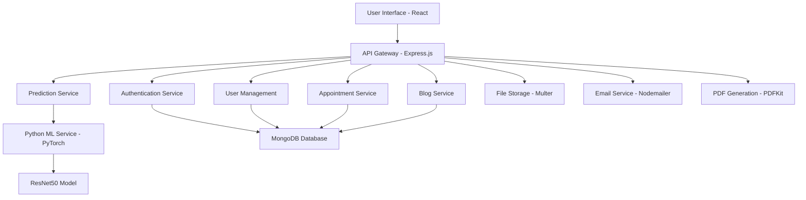
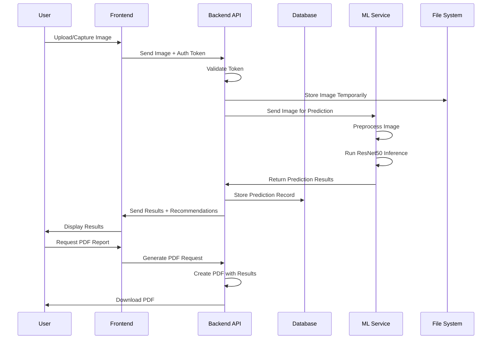
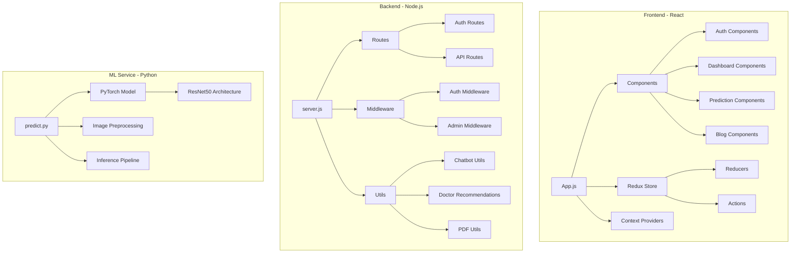

# Skinscope Project Documentation

## Project Overview

Skinscope is a comprehensive web application designed for skin disease detection and management. It combines machine learning technology with a user-friendly interface to help users identify potential skin conditions through image analysis and connect with healthcare professionals.

### Definition
Skinscope is an AI-powered dermatology assistant that enables users to:
- Upload or capture skin images
- Receive instant predictions of skin conditions using deep learning models
- Access personalized doctor recommendations
- Book appointments with specialists
- Generate and download medical reports
- Maintain a personal health record dashboard

### Key Objectives
- Democratize access to preliminary skin health assessments
- Bridge the gap between technology and healthcare
- Provide educational resources about skin conditions
- Facilitate doctor-patient connections

## Technology Stack

### Frontend
- **React 18.3.1**: Modern JavaScript library for building user interfaces
- **Redux 4.2.1**: State management with Redux Thunk for async operations
- **React Router DOM 6.23.1**: Client-side routing
- **Axios 1.7.2**: HTTP client for API communications
- **React Webcam 7.2.0**: Webcam integration for real-time image capture
- **Cropper.js 1.5.12**: Image cropping functionality
- **Material-UI Components**: Responsive UI components

### Backend
- **Node.js with Express 4.19.2**: Server-side JavaScript runtime and web framework
- **MongoDB with Mongoose 8.4.1**: NoSQL database for data persistence
- **JWT (JSON Web Tokens) 9.0.2**: Authentication and authorization
- **bcryptjs 2.4.3**: Password hashing
- **Multer 1.4.5**: File upload handling
- **PDFKit 0.15.0**: PDF generation for medical reports

### Machine Learning
- **PyTorch**: Deep learning framework
- **ResNet50**: Pre-trained convolutional neural network for image classification
- **Torchvision**: Computer vision library for image preprocessing
- **PIL (Pillow)**: Image processing library    

### Additional Technologies
- **TensorFlow.js 4.22.0**: JavaScript machine learning library (alternative implementation)
- **Sharp 0.33.4**: High-performance image processing
- **Nodemailer 8.0.3**: Email sending functionality
- **CORS**: Cross-origin resource sharing
- **Dotenv**: Environment variable management

## Core Features

### 1. User Authentication & Authorization
- Secure user registration and login
- JWT-based session management
- Password encryption with bcrypt
- Role-based access control (admin/user)

### 2. Skin Disease Prediction
- Image upload from device or camera capture
- Real-time image cropping and preprocessing
- AI-powered classification using ResNet50 model
- Prediction confidence scores
- Top 3 most likely conditions
- Support for 10 skin conditions:
  - Normal skin
  - Acne
  - Bullous diseases
  - Chickenpox
  - Dermatitis
  - Eczema
  - Hives
  - Measles
  - Monkeypox
  - Psoriasis

### 3. Doctor Recommendations
- Location-based doctor suggestions
- Specialization matching based on predicted condition
- Contact information and appointment booking
- Support for major Indian cities (Delhi, Mumbai, Bengaluru, Hyderabad, Chennai)

### 4. Appointment Management
- Online appointment scheduling
- Multiple time slots available
- Appointment notes and special requests
- Confirmation system

### 5. Medical Records Dashboard
- Personal health record storage
- Prediction history tracking
- Report generation and download
- Profile management

### 6. PDF Report Generation
- Automated medical report creation
- Includes prediction results, confidence scores
- Doctor recommendations
- Downloadable PDF format

### 7. Blog & Educational Content
- Health-related blog posts
- Skin care tips and information
- Admin panel for content management

### 8. AI Chatbot
- Interactive health assistant
- Basic medical queries and guidance
- Symptom checker integration

### 9. Multi-language Support
- English and Hindi language options
- Internationalization (i18n) framework

### 10. Contact & Support
- Contact form for user inquiries
- Email integration
- Customer support system

## System Architecture

### High-Level Architecture



### Data Flow Architecture



### Component Architecture



## Installation and Setup

### Prerequisites
- Node.js (v16 or higher)
- Python 3.8+
- MongoDB
- npm or yarn package manager
- PyTorch with torchvision

### Backend Setup
```bash
cd server
node server.js
# Set up environment variables in .env file
# Install Python dependencies
pip install torch torchvision pillow
```

### Frontend Setup
```bash
cd client
npm start
```

### Database Setup
- Install and start MongoDB
- Create database named 'skinscope'
- Collections will be created automatically

### ML Model Setup
- Place the trained ResNet50 model file in `server/model/resnet50_custom.pth`
- Ensure the model is trained on the 10 skin condition classes

## Usage Guide

### For Users
1. **Registration**: Create account with email and password
2. **Login**: Access the application
3. **Upload Image**: Use file upload or camera capture
4. **Crop Image**: Adjust the image for better prediction
5. **Get Prediction**: View AI-generated diagnosis
6. **Book Appointment**: Schedule consultation with recommended doctors
7. **Download Report**: Generate PDF medical report
8. **View Dashboard**: Track all predictions and records

### For Administrators
- Manage user accounts
- Create and edit blog posts
- Monitor system usage
- Access advanced features

## API Endpoints

### Authentication
- `POST /api/auth/register` - User registration
- `POST /api/auth/login` - User login
- `GET /api/auth/user` - Get current user info

### Predictions
- `POST /api/predictions/predict` - Submit image for prediction
- `GET /api/predictions/history` - Get user's prediction history

### Users
- `GET /api/users/profile` - Get user profile
- `PUT /api/users/profile` - Update user profile

### Appointments
- `POST /api/appointments/book` - Book appointment
- `GET /api/appointments` - Get user appointments

### Blog
- `GET /api/blogs` - Get all blog posts
- `POST /api/blogs` - Create new blog post (admin only)

## Security Features

- JWT token-based authentication
- Password hashing with bcrypt
- CORS protection
- Input validation with express-validator
- File upload restrictions
- Rate limiting (recommended for production)

## Future Enhancements

- Mobile application development
- Integration with telemedicine platforms
- Advanced AI models (GANs for data augmentation)
- Multi-language expansion
- Real-time video consultation
- Integration with hospital systems
- Advanced analytics dashboard

## Conclusion

Skinscope represents a comprehensive solution for preliminary skin disease detection, combining cutting-edge machine learning with user-friendly web technologies. The application bridges the gap between technology and healthcare, providing users with accessible tools for skin health monitoring while facilitating connections with medical professionals.

The modular architecture ensures scalability and maintainability, making it suitable for future expansions and integrations with broader healthcare ecosystems.

---

*This documentation provides a comprehensive overview of the Skinscope project. For detailed code implementation, refer to the source files in the repository.*
